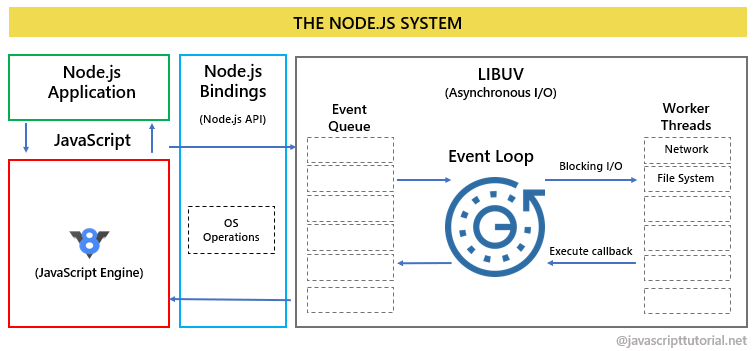
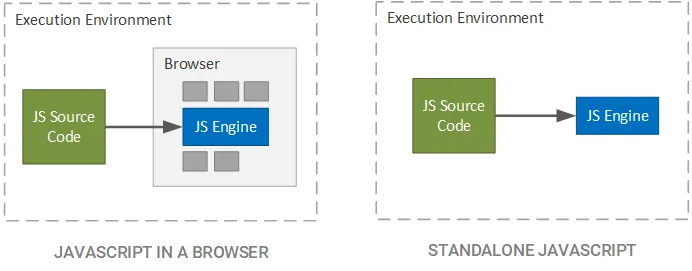

# JS Основы языка

## Что изучем?

- Основы языка (базовые типы и функции)
- Array и Object
- DOM и BOM
- Асинхронность

## Правило 20 часов vs 10000 часов

- Что конкретно хочу научиться делать?
- Рефлексия каждого занятия
- Практика 20 часов

https://www.youtube.com/watch?v=J_89IMS5gJQ [https://www.youtube.com/watch?v=J_89IMS5gJQ]

## Стандарты языка

- ES5 - 2009
- ES6 - 2015
- ES7 - 2016
  ...
- Современные стандарт ECMAScript

## Browser и Node.js

- 
- 

## Вставка JS в Browser

```html
<!DOCTYPE html>
<html>
<head>
    <meta charset="utf-8">
    <title>Страница с JavaScript</title>
    <link href="css/style.css" rel="stylesheet">
</head>
<body>
    <h1>Это страница с JavaScript</h1>
    <script src="js/app.js"></script>
</body>
</html>
```
!demo hello, world