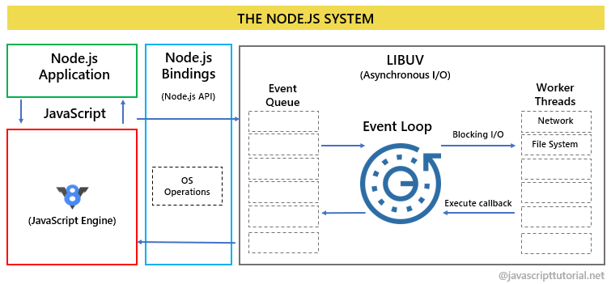
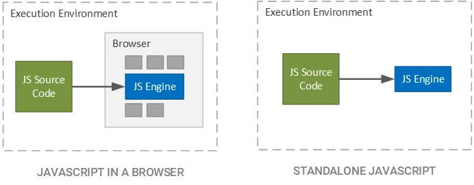

# JS Основы языка

## Что изучим?
- Основы языка (базовые типы и функции)
- Array и Object
- DOM и BOM
- Асинхронность

## Правило 20 часов vs 10000 часов
- Что конкретно хочу научиться делать?
- Рефлексия каждого занятия
- Практика 20 часов

https://www.youtube.com/watch?v=J_89IMS5gJQ [https://www.youtube.com/watch?v=J_89IMS5gJQ]

## Стандарты языка
- ES5 - 2009
- ES6 - 2015
- ES7 - 2016
  ...
- Современные стандарт ECMAScript

## Browser и Node.js
- 
- 

## Вставка JS в Browser
```html
<!DOCTYPE html>
<html>
<head>
    <meta charset="utf-8">
    <title>Страница с JavaScript</title>
    <link href="css/style.css" rel="stylesheet">
</head>
<body>
    <h1>Это страница с JavaScript</h1>
    <div id="root"></div>
    <script src="js/app.js"></script>
</body>
</html>
```
[demo](01-vars-and-base-types/01-hello-world/index.html)

## Node.JS и console.log
```node <script path>```

```console.log('foo') //foo```

## Объявление и присваивание
```js
// Объявление переменной
let i;
// Присвоение переменной значения
i = 1
console.log(i) // 1
// Объявление и присвоение переменной значение
let j = 24
const pi = 3.14
```
[demo](01-vars-and-base-types/02.js)

## Базовые типы данных
- Number
- String
- Boolean
- BigInt
- Object
- Null
- undefined
- Symbol

## Number
Числовой тип в JS представлен целочисленными значениями и числа с плавающей точкой
```js
const a = 4 // целочисленная 
const b = 4.2 // с плавающей точкой
```
Есть специальные значения Infinity, -Infinity и NaN.
```js
1 / 0 //Infinity
"foo" / 2 // NaN
```
- [demo](01-vars-and-base-types/03.js)
- [demo](01-vars-and-base-types/04.js)

## String

Строка - последовательность символов UTF-16.
```JS
// Три разных способа создать литерал строки
'стр" ffa " ока';
"тоже ст'ро'ка";
`еще одна стока ${'!'}`; //`еще одна стока !`

// Присвоение строки
const js = 'JavaScript'
console.log(js)

// сложение строк
console.log(js + ' ' + ts)
// строковая конкатенация
console.log(`${js} ${ts}`)
```
- [demo](01-vars-and-base-types/05.js)

## Boolean
Логический тип, может быть равен либо true, либо false
```js
// литералы логического типа
true;
false;

// Присвоение boolean
const isFoo = true;
console.log(isFoo)
```
- [demo](01-vars-and-base-types/06.js)

## Null и Undefined
Null - специальное тип значение (ссылкой на несуществующий объект).
undefined - тип для не присвоенных значений
```js
// литералы
null;
undefined;

// null
let user: User = null;
console.log(user)

// undefined
let men;
console.log(men)
```
- [demo](01-vars-and-base-types/07.js)

## Остальные типы
Object - специальный тип в js, рассмотрим позже детально

Symbol - еще один специальные, для создания уникальных идентификаторов в объектах, не будет рассматриваться в курсу

Bigint - новый тип, для целых чисел произвольной длины.


## Ветвления и циклы
Для управления потоком исполнения программы используются специальные инструкции языка

## Блок кода
```js
{
  console.log("1")
  console.log("2")
 {
   console.log("3")
   console.log("4")
 }
}
```

## Инструкция if
```js
if (<условие>) <инструкция> | <блок кода>
  
if (<условие>) <инструкция> | <блок кода>
[else <инструкция> | <блок кода>]
```
- [demo](02-flow/02.js)
- [demo](02-flow/03.js)
- [demo](02-flow/04.js)

## Тернарный оператор
```js
const age = 42
const isAccess = age > 18 ? 'Добро пожаловать!' : 'Страница не доступна'
console.log(isAccess)
```
- [demo](02-flow/05.js)

## while
```js
while (<условие>) <инструкция> | <блок кода>
```
- [demo](02-flow/06.js)
- [demo](02-flow/07.js)

## for, break, continue
```js
for ([<инициализация перед циклом>]; [<условие>]; [<изменение на каждом шаге>] <инструкция> | <блок кода>
```
- [demo](02-flow/08.js)
- [demo](02-flow/09.js)
- [demo](02-flow/10.js)

## switch
Конструкция switch сравнивает value с множеством значение и выполняет совпадающий блок
```js
switch(value) {
  case 'value1':
    <инструкции 1>
    [break]

  case 'value2':
    <инструкции 2>
    [break]

  [
  default:
    <инструкции>
    [break]
  ]
}
```
- [demo](02-flow/11.js)
- [demo](02-flow/12.js)

## Функция. Лямбды. Function Expression
Функция - важнейший элемент структурного программирования, позволяющий группировать и обобщать программный код.

## Объявление функции
```js
function <имя>(<параметры>) {
  <инструкции>
}
    
function hello() {
  console.log('Hello!')
}
```
- [demo](03-function/01.js)


## Объявление функции с параметрами
```js
function hello(name) {
  console.log(`Hello, ${name}!`)
}

hello("Jack") // Hello, Jack!
hello("Peeter") // Hello, Peeter
```
- [demo](03-function/02.js)

## Объявление функции с параметрами по-умолчанию
```js
function hello(name = "User") {
  console.log(`Hello, ${name}!`)
}

hello() // Hello, User!
hello(undefined) // Hello, User!
hello("Jack") // Hello, Jack!
hello("Peeter") // Hello, Peeter
```
- [demo](03-function/03.js)


## return 
Функция может возвращать значение, для этого используется return
```js
function sum(a, b) {
  return a + b
}
```
- [demo](03-function/04.js)

## Области видимости
Функция имеет доступ к внешним переменным, но если идентификатор совпадает с внешним, но локальная переменная перебивает внешнюю и внешняя переменная не доступна
```js
const defaultName = "User";
const name = "V"

function hello(name = '') {
  const currentName = name ? name : defaultName
  return `Hello, ${currentName}`
}

console.log(hello())
console.log(hello(42))
```
- [demo](03-function/05.js)

## Function expression
Функции можно сохранять в переменные
```js
const sum = function (a, b) {
  return a + b
}

console.log(sum) // выведет код функции
console.log(sum(40, 2)) //42
cosnt sum2 = sum
console.log(sum2(40, 2)) //42
```
- [demo](03-function/06.js)

## Immediately invoked function 
Можно создать функцию и сразу же ее вызвать
```js
const rst = (function (a, b) {
    return a + b
})(1, 2)

console.log(rst)
console.log((function (a, b) {
    return a + b
})(1, 2))
```
- [demo](03-function/07.js)

## Стрелочные функции
Более краткий синтаксис для создания функций.
Про особенность стрелочных функций мы поговорим, когда пройдем контекст
```js
const sum = (a, b) => { 
  return a + b
}

const sum2 = (a, b) => a + b
```
- [demo](03-function/08.js)