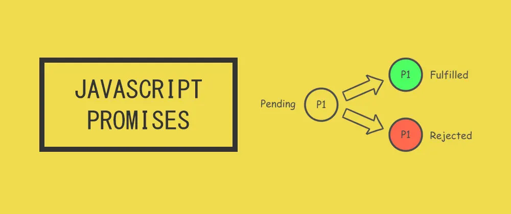

# Async

## Callback
- Callback - обычно называют функцию, которая передается в функцию как параметр и вызовется от при определенных условиях, например загрузятся данные или пользователь нажмет на кнопку

- Функция setTimeout, принимает функцию, время в миллисекундах и параметры функции. Функция выполнится примерно через указанное время

## EventLoop


## Callback hell
```js
import * as fs from 'fs';

const FILE_READ = 'file';
const currDir = __dirname + '/'

fs.readdir(currDir, function (err, files) {
    if (err) {
        console.error(err)
        return
    } else {
        files.forEach(function (filename) {
            if(filename === FILE_READ) {
                fs.readFile(currDir + filename, function (err, value) {
                    if (err) {
                        console.error(err)
                        return
                    }
                    console.log(value.toString())
                })
            }
        })
    }
})
```

## Promise
Объект Promise используется для отложенных и асинхронных вычислений.

Промис принимает функцию с двумя параметрами и ничего не возвращает. Полученная функция сразу выполняется(синхронно).
```js
const p = new Promise((resolve, reject) => {})

console.log(p) //Promise { <pending> }
```

## Promise
Два параметра, которая принимает функция, тоже являются функциями, принимающие один аргумент. Обычно их называют resolve и reject.

Промис может быть в 3х состояниях

- pedding - ожидание
- fultfilled - успешен
- rejected - неудачен

## Promise
- Изначальное устанавливается значение pedding, после изменения статуса, повторное изменение статуса не возможно. Для изменения статуса, нужно вызвать одну из функций(resolve или reject) и передать данные результата работы.
- Если вызвать resolve, то состояние промиса изменится с pending на fultfiled
- Если вызвать rejected, то состояние промиса изменится с pending на rejected

## Promise
Для того, чтобы узнать, когда промис разрешиться, используется метод then и catch. Then принимает две функции(вторая функция опционально). Одна из них будет вызвана, первая в случае перехода в fultfilled, а вторая в случае перехода в rejected. Обе функции имеют по одному аргументу, и туда передаются данные, с которыми были вызваны resolve и reject.
```js
const promise = new Promise((resolve, reject) => {
    setTimeout(() => {
        resolve(42)
    }, 1000)

    setTimeout(() => {
        reject('error')
    }, 2000)

})

promise
    .then(
        data => console.log(data),
        error => console.log(error)
    )
```


## Promise
Функции обработчики могут, которые передаются в then, могут вернуть значение. Если будет возвращен промис, то он дождется, пока этот промис разрешиться и вернет его из then, что позволяет делать цепочки вызовов
```js
const promise = new Promise((resolve, reject) => {
    setTimeout(() => {
        resolve(42)
    }, 1000)

    setTimeout(() => {
        reject('error')
    }, 2000)

})

promise
    .then(
        data => {
            console.log(data)
            return Promise.resolve('foo')
        },
        error => console.log(error)
    )
    .then(data => console.log(data))
```

## Catch
У объекта прописа есть еще catch и finally.
Catch - это псевдоним для then, где перевый аргумент null.
finally - вызывается всегда, даже если в цепочки есть rejected.
