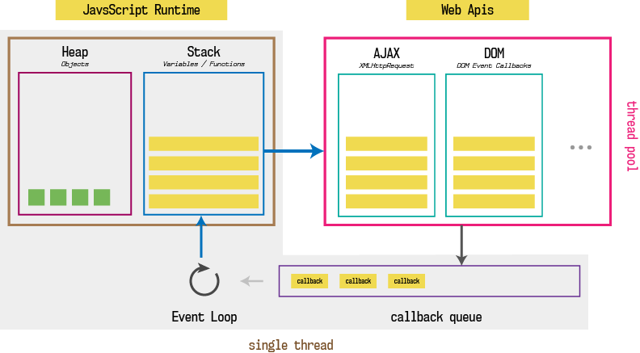

# Async

## Callback
- Callback - обычно называют функцию, которая передается в функцию как параметр и вызовется от при определенных условиях, например загрузятся данные или пользователь нажмет на кнопку

- Функция setTimeout, принимает функцию, время в миллисекундах и параметры функции. Функция выполнится примерно через указанное время

## EventLoop


## Callback hell
```js
import * as fs from 'fs';

const FILE_READ = 'file';
const currDir = __dirname + '/'

fs.readdir(currDir, function (err, files) {
    if (err) {
        console.error(err)
        return
    } else {
        files.forEach(function (filename) {
            if(filename === FILE_READ) {
                fs.readFile(currDir + filename, function (err, value) {
                    if (err) {
                        console.error(err)
                        return
                    }
                    console.log(value.toString())
                })
            }
        })
    }
})
```